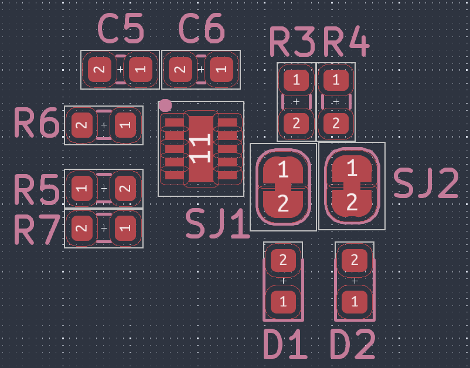

# 📦 typeCAD Package List

## 🧠 MCU

[ESP32S3](https://www.npmjs.com/package/@typecad/rd_esp32s3) - Reference design for the ESP32-S3 module

---

## 📐 Sensor

## 🔌 Power

## 🔋 Battery

## Creating packages
Visit the [walkthrough](https://typecad.net/docs/packages/overview) for information on creating a package. Then, create an issue in this repo or submit a PR to add your package to the list. 
